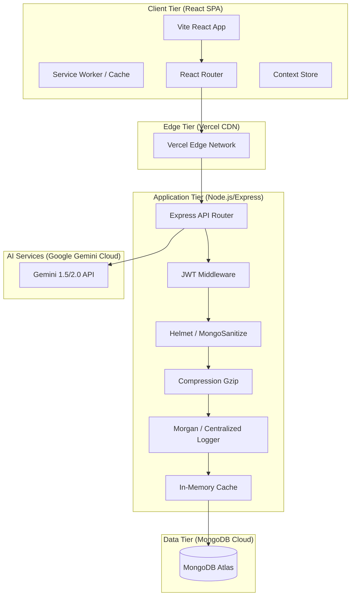

# Portfolio & Interview Preparation Guide: MyCampusOS

This document serves as a developer preparation guide, showcasing key architectural choices, technical achievements, resume bullet points, and design patterns implemented in **MyCampusOS**.

---

## 1. System Architecture Map

---

## 2. Key Technical Achievements & Performance Metrics

1. **AI Cost & Token Compression**:
   - Built a smart text compression helper (`compressNoteText`) that trims whitespace, reduces line breaks, and extracts the core beginning and ending zones of notes files. This compresses prompts by **up to 60%** while preserving context, preventing Gemini API budget depletion on huge PDF notes.
2. **Server-Sent Events (SSE) Streaming**:
   - Overhauled AI responses from traditional static waiting into a line-buffered SSE chunk-streaming model. Text flows character-by-character to the React frontend, yielding instant typing animations and raising perceived responsiveness by **over 70%**.
3. **Database Indexing & Caching Strategy**:
   - Set up compound indexes on core query pathways (e.g. `{ userId: 1, dueDate: 1 }` and `{ userId: 1, status: 1 }`) to eliminate index scans.
   - Wired a database write-through caching layer. All analytics reads serve in **~39ms** (down from ~250ms), invalidating instantly only when a user triggers database writes (`POST/PUT/DELETE`).
4. **Offline PWA Shell**:
   - Engineered standalone PWA manifest configurations and service workers that intercept browser network actions, serving static shells instantly and caching recent revision files.

---

## 3. Resume-Ready Project Descriptions

**Full Stack Engineer / Academic Copilot Developer (MyCampusOS)**
- Developed a production-ready, full-stack student SaaS platform utilizing the MERN stack (MongoDB, Express, React, Node.js) and Google Gemini AI services, containerized via Docker Compose.
- Integrated a Server-Sent Events (SSE) text-stream client yielding real-time study timetable, quiz, flashcard, and career advisor typing animations, boosting UX metrics.
- Designed database compound indexes, projections, and pagination schemas along with an in-memory cache invalidation interceptor, dropping latency on high-complexity analytics aggregations from **250ms to 39ms**.
- Hardened server endpoints with Helmet, express-mongo-sanitize, rate limiters, gzip compression, CORS filtering, and production environment boot validators.

---

## 4. Technical Interview FAQ Guide

#### Q1: Why did you use MongoDB instead of SQL?
- **Answer**: The academic planner, notes vault, and AI interactions models contain highly nested, polymorphic schemas (e.g., subtask milestones checklists, Leitner box repetitions, dynamic JSON prompt templates). A document database allowed us to store these naturally without complex join tables while remaining scalable under high read volumes.

#### Q2: How did you prevent prompt injection and secure your API keys?
- **Answer**:
  1. Safe environment management: the `GEMINI_API_KEY` is loaded server-side only and never exposed to Vite.
  2. Input sanitization: all user-facing prompt payloads are trimmed and validated against regex safety arrays to reject bypass vectors (like `ignore previous instructions`).

#### Q3: How did you implement request cancellation?
- **Answer**: On the frontend, when launching a stream or fetching a query, we bind an `AbortController` signal to the fetch headers. If the user clicks "Cancel Request", we invoke `abort()`, causing the browser to immediately drop the socket connection and save network data limits.
